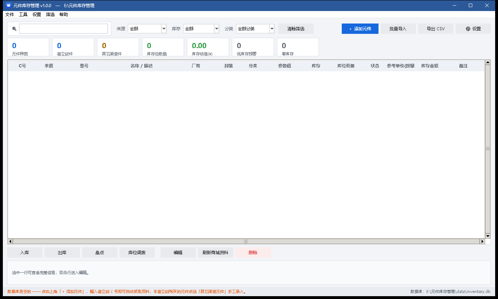
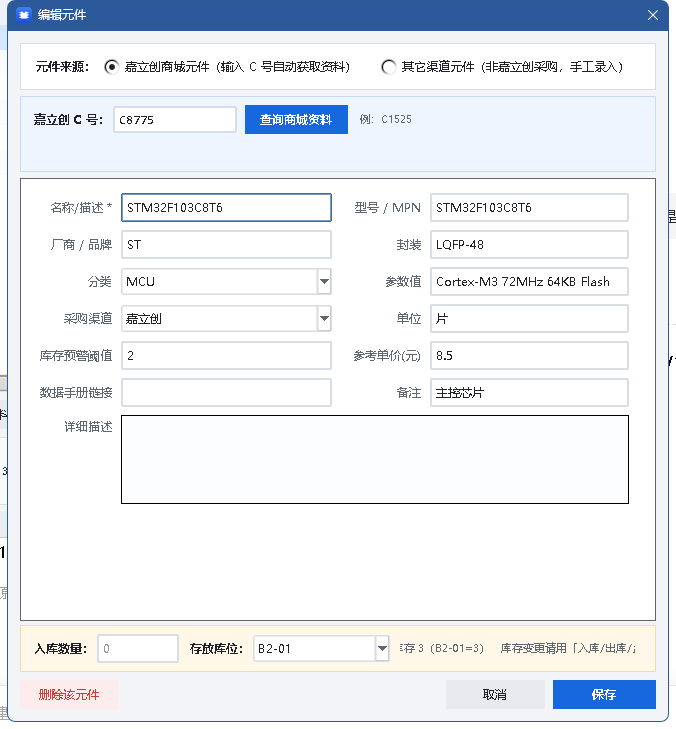

# 元件库存管理 · Component Inventory


**简体中文** | [English](README_EN.md)

一个给硬件工程师自用的电子元器件库存管理程序。





**核心特点**

- 输入**嘉立创 C 号**即可自动抓取元件资料（型号、厂商、封装、分类、参考单价、数据手册）
- **非嘉立创购买**的元件（淘宝、线下市场、拆机件等）同样可以入库，走"其它渠道元件"手工录入，并能在列表里单独筛选出来
- 出入库、盘点、库位调拨全程留痕，可查流水、可导出
- **界面中英文切换**，汇率**自动联网获取**，商城接入点**自动选最可用的那个**
- 单文件 exe，**免安装、双击即用**，数据就在 exe 旁边，拷走即搬走

---

## 一、快速开始

### 1. 下载

到仓库的 **[Releases](../../releases)** 页下载，按你的系统二选一：

| 下载这个 | 用在 | 说明 |
|---|---|---|
| **`component-inventory_v1.0.1_x64.exe`** | 64 位 Windows | 现在的电脑几乎都是，优先选它 |
| **`component-inventory_v1.0.1_x86.exe`** | 32 位 Windows | 老机器 / 32 位系统；64 位系统上也能跑 |

两版的**功能与界面完全一致**，区别只在编译时的位数。

不知道自己是哪种系统、担心下错，看下一节。

### 2. 启动

把它放进任意文件夹（U 盘也行），**双击**就运行。

- 单文件 exe 首次启动要先解压自己，约 **3~5 秒**，之后会快一些
- 启动后直接就是主界面，不需要安装、不写注册表

### 3. 数据放在哪

程序会在 exe **同一个目录**下自动建 `data\`：

```
data\
├── inventory.db      ← 你的全部元件与库存数据都在这一个文件里
├── settings.json     各项设置（界面语言、预警阈值、汇率、勾选项）
└── backup\           数据库备份
```

所以整个文件夹可以直接拷到 U 盘或另一台电脑上接着用，不用改任何配置。

> **别把 exe 单独拖出来放到别处** —— 它会认为旁边是一个全新的空仓库。
> 要移动就整个文件夹一起移。
>
> 如果你把文件夹放进了 `C:\Program Files` 这类**需要管理员权限**的位置，
> 程序写不进数据时会自动改存到 `%APPDATA%\元件库存管理\`，程序照常能用。

### 4. 杀毒软件报警怎么办

单文件 exe 本质上是个自解压程序，个别杀毒软件会敏感报警。
加到白名单即可；源码就在发布页旁边的压缩包里，不放心的可以自己核对。

---

## 二、我该下载哪个版本

| | `component-inventory_v1.0.1_x64.exe` | `component-inventory_v1.0.1_x86.exe` |
|---|---|---|
| 适用系统 | 64 位 Windows | 32 位 Windows；64 位系统上也能跑 |
| 文件大小 | 约 10 MB | 约 8.8 MB |
| 功能 | 完全一致 | 完全一致 |

**怎么选：**

- Win 10 / 11 基本都是 64 位系统 → 选 **`x64`**
- **拿不准就选 `x86`** —— 32 位程序在 64 位 Windows 上**一定**能跑
  （系统自带 WOW64 兼容层），反过来才不行
- 想看自己电脑是什么系统：桌面「此电脑」右键 →「属性」→ 看"系统类型"

**选错了是什么样：** 双击后提示「不是有效的 Win32 应用程序」。
这不是文件损坏，也不是杀毒软件干的，换另一个版本就行。

**另外两条常见的启动问题：**

| 现象 | 原因与处理 |
|---|---|
| 「Windows 已保护你的电脑」 | 程序没有花钱买数字签名，未签名程序的常规提示。点「更多信息」→「仍要运行」 |
| 双击后没有任何反应 | 多等几秒（首次解压慢）；若仍无窗口，检查是不是被安全软件静默拦截了 |

> `x86` 版作为 32 位程序最多能用约 2 GB 内存。本程序要管理的库存量级
> 远远够不到这个上限，正常使用不会有任何区别。

---

## 三、界面语言、汇率与接入点

这三项都在 **「设置 → 常规设置」** 里（快捷键 `Ctrl+,`）。

### 1. 界面语言（中文 / English）

设置窗口最上面有「界面语言」下拉框，选 **English** 后点「保存」，
菜单、表头、按钮、提示语会**立刻**变成英文，**不用重启**。

- 中文是原生语言，英文缺失的地方会自动**回退显示中文**，不会出现空白或报错
- 元件资料（型号、厂商、分类、参数值）和你写的备注、库位名属于**数据**，
  不会被翻译 —— 只翻译界面本身
- 也可以直接改配置文件：`data\settings.json` 里的 `language` 字段（`zh` / `en`）

### 2. 汇率自动获取

嘉立创国际站的报价是**美元**，程序要折成人民币，用的是**联网取回的实时汇率**：

- 启动后 1.5 秒在后台自动更新一次（不卡界面），12 小时内不重复请求
- 设置窗口里点 **「立即获取」** 可以手动刷新，旁边会显示
  `1 USD = 6.7218 CNY（open.er-api.com，2026-09-18 00:20）` 这样的状态
- 取不到网时沿用上一次的值；从没取到过就用离线兜底值 7.2（可手动改）
- 想固定用一个值：取消勾选「启动时自动更新汇率」，再手动填汇率

> 改了汇率后，已录入的元件价格**不会自动重算**。想刷新，
> 选中元件右键 → **「从嘉立创商城刷新资料」**。

### 3. 商城接入点自动检测

嘉立创的元件查询有几个不同的接入点，不同地区、不同网络下可用性差别很大。
程序会**并发探测**，自动挑出最快**且真正能取到数据**的那个：

| 接入点 | 说明 |
|---|---|
| 嘉立创国际站 `jlcpcb.com` | 目前实际可用的主力接入点 |
| 嘉立创国内站 `szlcsc.com` | 国内网络快，但该接口不对第三方程序开放，取不到数据 |
| LCSC 国际商城 `lcsc.com` | 部分网络下会被拦截 |

- 首次启动后自动检测一次，结果显示在设置窗口的「接入点」一栏
- 也可以点 **「自动检测」** 重新测，或在下拉框里**手动锁定**某一个接入点
- **检测不是只测延迟**：会真的发一次查询（用 `C1525` 这片电阻），
  能取回数据才算"可用"。否则会出现"国内站延迟 300ms 最快，
  但什么都查不到"这种坑

> 探测在后台跑，不联网时最多等几秒就返回，程序照常能用 ——
> 只是不能自动补全资料，手工录入和出入库不受影响。

---

## 四、录入元件

### 1. 嘉立创商城买的元件

1. 点右上角 **「＋ 添加元件」**
2. 保持选中 **「嘉立创商城元件（输入 C 号自动获取资料）」**
3. 在 C 号框里填 `C1525` 这种编号 —— 填完稍等一下就会**自动查询**
   （也可按回车或点「查询商城资料」）
4. 程序自动填好：名称/描述、型号、厂商、封装、分类、参数值、**详细描述（中文）**、
   采购渠道、参考单价、数据手册链接
5. 填「入库数量」和「存放库位」→ 点 **「保存」**

> - C 号写不写 `C` 都可以，`1525`、`c1525`、`C1525` 都能识别
> - 同一个 C 号重复录入**不会产生重复记录**，只会把数量追加到库存里
> - 查询结果会缓存 7 天，重复查询同型号不再联网；启动时自动清理过期缓存
> - 详细描述自动整理成中文，商城英文原文显示在描述框下方那行小字里
>   （详见「常见问题」）
> - 参考单价按美元汇率折算成人民币，汇率**自动联网获取**（见第三节），
>   取不到网时用设置里的兜底值 7.2
> - 程序会保存商城的**整张阶梯价表**，库存金额按当前数量匹配到的档位单价计算
>   （详见第七节）
> - 不想要自动查询，可在「设置」里关掉「添加元件时自动查询商城资料」

### 2. 非嘉立创购买的元件

1. 点 **「＋ 添加元件」**
2. 切到 **「其它渠道元件（非嘉立创采购，手工录入）」**
3. 手工填写名称/描述、型号、采购渠道（例如"淘宝-华强北"）、封装、数量等，全程不联网
4. 点 **「保存」**

这类元件在列表的「来源」列显示为 **其它渠道**。

---

## 五、筛选与查找

这是把嘉立创件和非嘉立创件分开管理的核心。

| 筛选项 | 可选值 | 用途 |
|---|---|---|
| 来源 | 全部 / **仅嘉立创** / **仅其它渠道** | 把非嘉立创采购的元件单独挑出来 |
| 库存 | 全部 / 有库存 / 零库存 / **低库存预警** | 找出快用完的、已经没了的 |
| 分类 | 电阻、电容、MCU… | 按类别浏览 |

- 搜索框支持 C 号、型号、名称、厂商、封装、参数值、**库位**、备注，边打边筛
- 点任意列标题排序，再点一次切换升/降序
- 菜单栏 **「筛选」** 里也有同样的入口，一键切换

> **列表一次最多画 500 行。** 元件上万时，把整张表画出来会拖慢每一次搜索，
> 所以表格只显示前 500 条（状态栏会写明「最多显示 500 行」）；数据一条都没少，
> 缩小筛选范围就能看到其余部分，排序也是在**全部**筛选结果里进行的。

---

## 六、出入库

在列表里选中一个或多个元件（`Ctrl` 多选、`Shift` 连选），然后：

| 操作 | 说明 |
|---|---|
| **入库** | 增加库存（新买的料入账） |
| **出库** | 减少库存；数量不够会被拦住，不会出现负库存 |
| **盘点** | 把某库位数量**直接改成**实际清点值，差额自动记流水 |
| **库位调拨** | 在两个库位之间转移，总数不变 |

每个操作都可以填操作人和备注。所有变动都会记入流水，在
**「帮助 → 出入库流水记录」** 里查看，也可以单独导出 CSV。

想只看**某一个元件**的来龙去脉（什么时候入的、谁领走的），在列表里右键那一行，
选 **「查看该元件的出入库记录」**。

> **库存与流水一定对得上。** 改库存和记流水是同一次写入，
> 中途断电或程序崩掉会整体回滚，不会出现「库存少了但查不到是谁出的库」。
>
> **允许负库存（可选）。** 出库数量超过库存时默认被拒绝。如果你习惯
> 「先把料拿走、事后再补登记入库」，可以在出库窗口勾选
> **「允许负库存（先出库、后补登记入库）」**，或在「设置」里默认打开。
> 这时数量会真的记成负数，并在流水备注里写明欠账多少个，库存和流水依然对得上。

---

## 七、库存金额怎么算的

嘉立创的报价是**分档**的：买 1 片、1000 片、10000 片的单价都不一样，量越大越便宜。

程序会把商城的**整张阶梯价表**存下来，然后：

- **参考单价(按量)** 列 = 按**当前库存数量**匹配到的档位单价
- **库存金额** 列 = 库存数量 × 该档位单价

举一个真实例子（C5369112）：

| 阶梯档位 | 单价 |
|---|---|
| 1+ | $0.0188 |
| 500+ | $0.0146 |
| 2000+ | $0.0123 |
| 50000+ | $0.0091 |

库里存了 600 个，就按 **500+ 档**算：0.0146 × 6.72（实时汇率）= **¥0.0981/个**，
库存金额 = 600 × 0.0981 = **¥58.86**。

> 因为两个数字用的是同一个口径，**「库存数量 × 参考单价(按量)」能手工对得上「库存金额」**。
> 零库存的元件没有档位可匹配，单价显示为单片挂牌价。
>
> 手工录入的元件（其它渠道）没有阶梯价，按你自己填的「参考单价」算。
>
> 想让早先录入的元件也用上阶梯价，选中它们右键
> **「从嘉立创商城刷新资料」** 更新一次即可。

---

## 八、批量导入

点 **「批量导入」**（快捷键在「文件」菜单），两个标签页：

### ① 粘贴 C 号 / BOM 清单

每行一个，支持这些写法：

```
C1525 100
C1525 x100
C1525,100
1  C1525  100nF  0402  100      ← 立创 BOM 导出的整行也能识别
```

同一行的 C 号出现多次会自动累加数量。

### ② 从 Excel / CSV 文件导入

支持 **`.xls`（Excel 97-2003）、`.xlsx`、`.csv`**，以及网页导出的"伪装成 .xls
的表格文件"。**不需要机器上装 Excel 或任何插件。**

1. 点「浏览…」选文件。程序会先显示**识别结果**，再列出预览，确认无误再导
2. 如果文件有多个工作表（比如"订单信息 + 商品明细"），会出现「工作表」下拉框，
   默认选行数最多的那个，可以随时切换
3. 表头自动识别，常见列名都能对上号：

| 认到的字段 | 常见的列名写法 |
|---|---|
| C 号 | 嘉立创C号、C号、商品编号、商品编码、立创编号、元件编号、物料编码、编码… |
| 型号 | 型号、规格型号、商品型号、制造商编号、MPN |
| 名称 | 名称、商品名称、元件名称、描述、名称/描述 |
| 厂商 | 厂商、品牌、制造商、生产厂商 |
| 封装 | 封装、封装形式、Package |
| 数量 | 数量、购买数量、下单数量、采购数量、库存总数、订货数量 |
| 单价 | 单价、采购单价、商品单价、含税单价、参考单价 |
| 库位 | 库位、位置、存放位置 |

表头前有标题行没关系（会自动往下找）；整列找不到表头时会按内容推测
（哪一列像 C 号、哪一列像数量），并提示你核对预览。

**两个勾选项：**

- **已存在的元件只追加库存、不覆盖已录入的资料**（默认勾上）
  采购记录反复导入时用这个：数量会累加，已经手工补过的分类/备注/预警阈值
  不会被表格里的空值冲掉
- **新建元件时联网补全嘉立创商城资料**（默认勾上）
  表里没有的新 C 号会去商城取中文描述、分类、实时价格。批量很大或没网时
  可以取消勾选，直接按表格里的信息建档，事后再点「刷新选中元件的商城资料」

> 表格里的日期列（如"下单日期"）会被正常读成 `2026-09-01`，
> 不会显示成 45123 这种序列号。含公式的列取计算结果。

---

## 九、导出与备份

- **文件 → 导出全部清单为 CSV** / **导出当前筛选结果** —— 用 Excel 直接打开，中文不乱码
- **文件 → 导出出入库流水** —— 全部出入库记录
- **文件 → 备份数据库** —— 把数据库备份到 `data\backup\`，文件名带时间戳
- 导出的 CSV 默认放在 `导出\` 目录

> 备份是给数据库做一份**前后一致的快照**，所以即使程序正在使用、
> 后台正好在写入，备份出来的也是完整可用的，不会出现半新半旧的坏文件。
> 建议定期点一下，尤其是大改动之前。

---

## 十、换电脑与数据安全

### 换电脑 / 搬到 U 盘

把**整个文件夹**（exe + `data\`）一起拷贝走即可，程序路径全是相对推导，不用改任何配置。

### 定期备份

「文件 → 备份数据库」，备份文件在 `data\backup\`。
数据库是**单个文件** `data\inventory.db`，想留一份"离线保险"直接复制它也行
（复制时最好先关掉程序）。

### 程序联网做什么

程序**不收集、不上传任何本地数据**，没有账号、没有遥测、没有云端同步。

只有下面三件事会联网，每件都可以在设置里关掉或手动控制：

| 什么时候 | 联网做什么 |
|---|---|
| 查询 / 刷新元件资料 | 向嘉立创商城查询该 C 号的公开资料 |
| 启动后或点「立即获取」 | 取一次美元汇率 |
| 首次启动或点「自动检测」 | 探测哪个商城接入点可用 |

断网时以上都不影响手工录入、出入库、筛选、导出和备份。

### 数据在哪、有没有备份价值

`data\inventory.db` 是标准 SQLite 文件，也是你唯一的资产 ——
删掉程序本身不会动它，反过来删掉它就没有了。搬机器、重装系统前先备份它。

---

## 十一、常见问题

**Q：设置在哪里？**

顶部菜单栏有独立的 **「设置」** 标签（工具栏最右侧也有一个「⚙ 设置」按钮）：

- **常规设置…**（`Ctrl+,`）—— 界面语言、低库存预警阈值、默认操作人、
  美元汇率（含「立即获取」）、商城接入点（含「自动检测」）
- **添加元件时自动查询商城资料** —— 勾上后，添加元件时填完 C 号会自动联网取资料
- **删除元件前二次确认** —— 关掉后按 Delete 直接删，谨慎使用
- **清空商城数据缓存** / **打开数据目录**
- **恢复默认设置…** —— 把上述设置恢复出厂值，**不影响元件与库存数据**

设置存在 `data\settings.json`，删掉它也会恢复默认。

**Q：怎么切换成英文界面？**

「设置 → 常规设置」，最上面的「界面语言」选 **English**，保存后立刻生效，不用重启。
也可以直接改 `data\settings.json` 里的 `"language": "en"`（详见第三节）。

**Q：汇率是自动的吗？想自己定一个固定值怎么办？**

是自动的 —— 启动后会在后台联网取实时汇率（如 1 USD = 6.72 CNY），
12 小时内不重复请求；在设置里点「立即获取」可手动刷新。
想固定用某个值：取消勾选「启动时自动更新汇率」，再手动填汇率即可（详见第三节）。

**Q：提示"无法连接嘉立创商城"？**

网络不通，或商城接口临时不可用。先在「设置 → 常规设置 → 接入点」点一下
**「自动检测」**，看看是不是当前接入点不通、有没有别的可用。
这不影响手工录入和出入库，只是不能自动补全资料。
如果公司网络有代理，需要在系统的环境变量里配置。

**Q：C 号查询提示"商城未收录"？**

确认 C 号是否写错。部分停产品、非标品在商城的 SMT 元件库里查不到，
这种情况下切换到「其它渠道元件」手工录入即可。

**Q：详细描述怎么都是英文？**

程序查的是嘉立创**国际站**的 SMT 元件库，该库返回的原始资料只有英文
（国内站虽有中文，但接口不对第三方程序开放）。

程序内置了一份元器件术语词典，会把商城的英文属性表整理成中文，例如：

```
英文    Termination Style = Gull Wing ｜ Circuit = SPST ｜ Life = 100,000 Cycles
中文    端子形式：鸥翼引脚 ｜ 电路：单刀单掷 ｜ 寿命：10万次
```

数值和单位（12V、100nF、4.5mm）一律原样保留，不换算、也不会把型号翻译坏。
英文原文显示在描述框下方的小字里，随时可以对照。

遇到词典没收录的词，可以自己加 —— 编辑 `data\i18n_custom.json`
（文件不存在就新建一个）：

```json
{
  "属性名": { "Voltage Rating": "额定电压" },
  "值":     { "Gull Wing": "鸥翼引脚" },
  "类型":   { "Tactile Switches": "轻触开关" }
}
```

保存后重启程序生效。

**Q：参考单价和商城页面上的数字对不上？**

商城国际站的报价单位是**美元**，程序按实时汇率（如 1 USD = 6.72 CNY）
折算成人民币，所以数字会大几倍，这是正常的。汇率可以手动改成固定值；
改完重新刷新一次元件资料即可更新已录入的价格。

而且**「参考单价(按量)」显示的是当前库存数量对应的那个档位价**，不是 1 片价。
比如某个元件 1 片档是 ¥0.1263、500+ 档是 ¥0.0981，那么：
库存 300 个时该列显示 0.1263，库存 600 个时显示 0.0981，库存金额也跟着变
（详见第七节）。这是为了让「数量 × 单价 = 金额」能对得上，不是算错了。

如果你只想知道单片挂牌价，把库存改成 1 看那一列即可，或者查商城页面。

**Q：库存金额和我心里估的不一样？**

先看是不是这几个原因：

1. **按档位算的**：金额用的是当前数量匹配到的档位单价，比 1 片价低不少
2. **只算了元件本身**：不含税费、运费，也不含 PCB、外壳这些非元件成本
3. **手工录入的件没有阶梯价**：只按你填的「参考单价」算，可以自己填个大概值
4. **历史数据没重算**：改了汇率或想用上阶梯价，选中元件右键
   **「从嘉立创商城刷新资料」** 更新一次

**Q：库存预警的阈值怎么定？**

「设置 → 常规设置」里设一个全局阈值（默认 10）；个别元件可以在编辑窗口里
单独设置「库存预警阈值」，单独设置的值优先。
低于阈值的行在列表里会变成橙色，零库存变红色。

首页的 **「低库存预警」卡片不含零库存** —— 零库存单独算在「零库存」卡片里，
所以两张卡片的数字不会重复计数，「低库存 + 零库存」正好等于需要补货的元件种类数。

**Q：我的采购记录是 .xls，能导入吗？**

能。点「批量导入 → 从 Excel / CSV 文件导入」，文件类型选默认的"Excel / CSV 表格"
就能看到 `.xls` 文件。程序读的是文件真实内容（不靠扩展名）：
真·Excel 二进制、xlsx、网页导出的表格、CSV 都能读。
如果某个文件读不了，在 Excel 里另存为 `.xlsx` 或 `.csv` 通常就能解决。

**Q：数据库能直接用别的工具打开吗？**

可以，是标准 SQLite 文件，用 DB Browser for SQLite 之类的工具就能打开
`data\inventory.db`。

**Q：界面字体/缩放不对？**

在 Windows 显示设置里调整缩放比例后，重启程序即可。

**Q：程序出错了，或者点了按钮没反应，怎么办？**

程序会把出错信息写进 `data\logs\app.log`（和 exe 在同一个目录下）。真的出错时会弹一个
提示框，下次启动状态栏也会提醒一句「上次运行出现过错误」。

点 **「帮助 → 打开运行日志」** 就能直接打开这个文件。反馈问题时把它附上，
就能定位到具体是哪一步出的错；日志体积有上限、会自动轮转，随时删掉也不影响程序。

**Q：一定要用 exe 吗？能不能直接跑源码？**

可以。发布页的压缩包里就是完整源码，解开后双击 **`启动程序.bat`** 即可
（需要机器上装了 Python 3.7 以上，且安装时勾选了 `tcl/tk and IDLE`，
官方安装包默认勾选）。这种方式和 exe 用起来完全一样，数据同样落在程序旁边。

---

## 许可

未附带开源许可证。代码供参考与个人使用。
